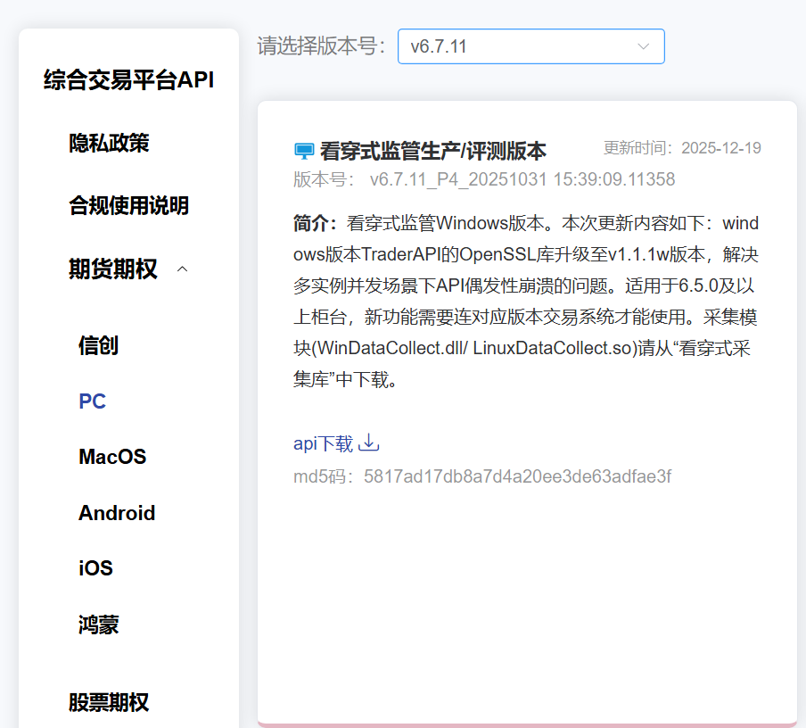
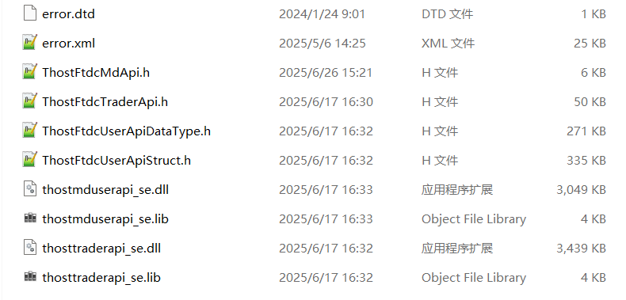
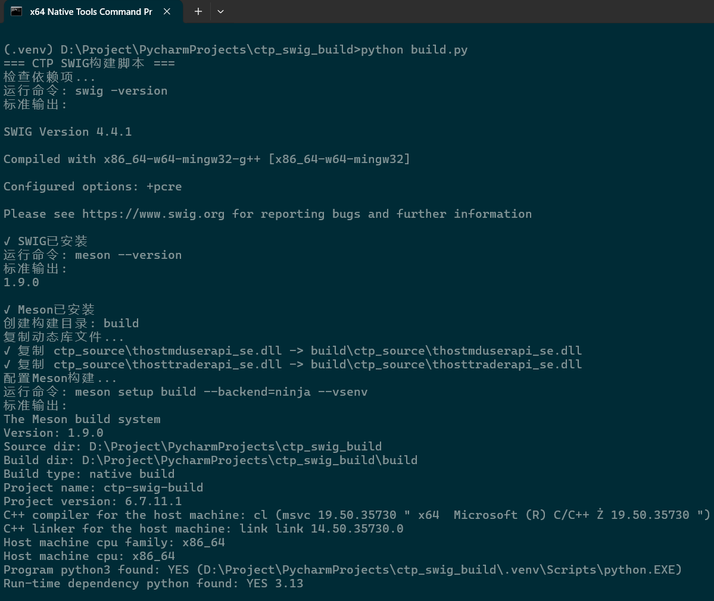
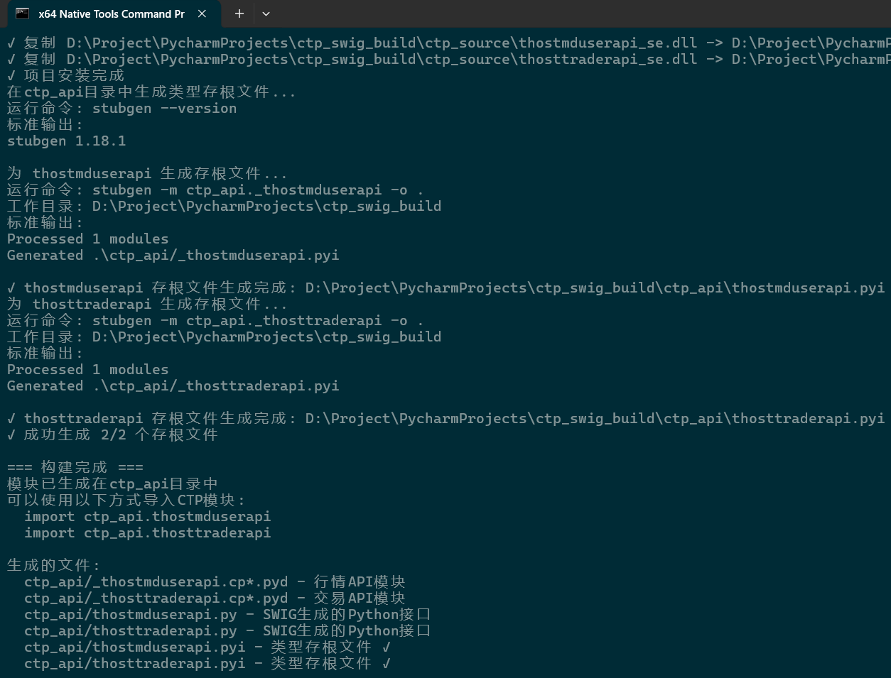
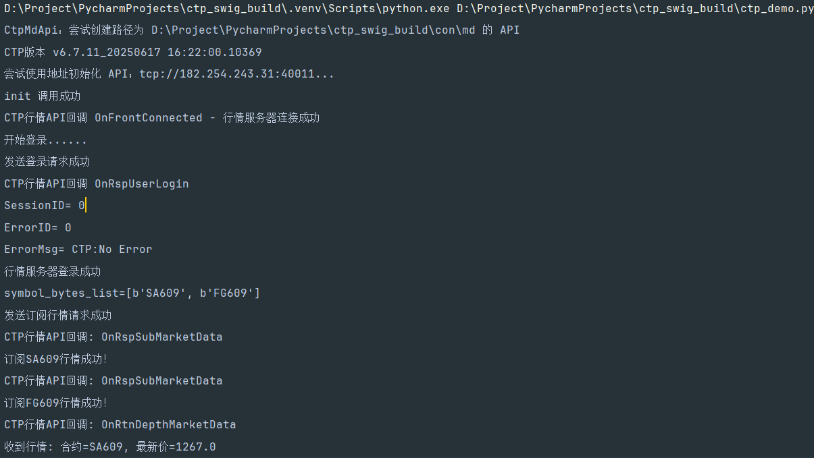

<h1 align="center">ctp-swig</h1>

<p align="center">
✨ One-Click Automated Compilation of CTP API C++ and Python Bindings ✨
</p>


<p align="center">
  English |
  <a href="README_CN.md">简体中文</a>
</p>
# Project Description

Currently, the API provided by the SHFE Technology CTP interface is a C++ version. This document primarily describes how to use the SWIG tool on a Windows 64-bit platform to convert the CTP C++ interface into a Python-callable interface. By automatically wrapping the native CTP C++ API into a Python API, this project facilitates CTP Python developers in maintaining the latest CTP interfaces and enables rapid version upgrades.

**Note:** This project has not undergone exhaustive testing; please perform your own testing.

Click here to directly access and try out the pre-compiled Python API files:

- [Github Releases](https://github.com/ctp-api/ctp-swig/releases)
- [GitCode Releases](https://gitcode.com/ctp-api/ctp-swig/releases)

## 1. Build Environment

This project was built using the following environment; if you choose to use different versions, please make the appropriate adjustments.

- **Windows 11 + MSVC** (provided by Visual Studio 2022)
- **Python 3.13.6**, installed via UV.
- **CTP v6.7.11**: [Official CTP Download Link](https://www.simnow.com.cn/static/apiDownload.action)
- **Meson + Ninja**: A modern build system for C++ extensions.
- **SWIG**: Used to create bindings between C++ and Python.
- **UV**: A modern Python package manager offering faster installation speeds and smarter dependency resolution.

## 2. Project Structure

```reStructuredText
/
├── 📁 assets/			# Assets folder, containing images and other resources
├── 📁 ctp_api/			# CTP API build artifacts folder
│   ├── 📁 __init__.py
│   ├── 📁 _thostmduserapi.cp313-win_amd64.pyd	# Market Data API module
│   ├── 📁 _thosttraderapi.cp313-win_amd64.pyd	# Trading API module
│   ├── 📁 thostmduserapi.py		# Python Market Data interface (generated by SWIG)
│   ├── 📁 thosttraderapi.py		# Python Trading interface (generated by SWIG)
│   ├── 📁 thostmduserapi.pyi		# Type stub file
│   ├── 📁 thosttraderapi.pyi		# Type stub file
│   ├── 📁 thostmduserapi_se.dll	# Market Data API Dynamic Link Library (DLL)
│   └── 📁 thosttraderapi_se.dll	# Trading API Dynamic Link Library (DLL)
├── 📁 ctp_source/                  # Stores the original CTP interface files
│   ├── 📁 error.dtd					# Contains definitions for all possible error messages
│   ├── 📁 error.xml					# Contains definitions for all possible error messages
│   ├── 📁 ThostFtdcMdApi.h				# C++ header file containing market data retrieval commands
│   ├── 📁 ThostFtdcTraderApi.h			# C++ header file containing trading-related commands
│   ├── 📁 ThostFtdcUserApiDataType.h	# Contains definitions for all data types used in the API
│   ├── 📁 ThostFtdcUserApiStruct.h		# Contains definitions for all data structures used in the API
│   ├── 📁 thostmduserapi_se.dll		# Market Data API Dynamic Link Library (DLL)
│   ├── 📁 thostmduserapi_se.lib		# Market Data API Static Link Library (.lib)
│   ├── 📁 thosttraderapi_se.dll		# Trading API Dynamic Link Library (DLL)
│   └── 📁 thosttraderapi_se.lib		# Static link library for the trading module
├── 📁 demo/				# Build demonstration
│   └── 📁 ctp_demo.py		# Test script; run this to verify if the build was successful
├── 📁 build.py				# Build script
├── 📁 meson.build			# Meson configuration file (ignore this if you are unfamiliar with Meson)
├── 📁 thostmduserapi.i		# Interface file; instructs SWIG which market data classes and methods to wrap
├── 📁 thosttraderapi.i		# Interface file; instructs SWIG which trading classes and methods to wrap
├── 📁 pyproject.toml		# Python project configuration file (automatically generated by UV)
├── 📁 README.md			# Project documentation (English)
├── 📁 README_CN.md         # Project documentation (Chinese)
├── 📁 uv.lock				# UV lock file (automatically generated by UV); can be ignored
└── 📁 ...					# Other files
```

## 3. Preparation

- **Download the Official CTP API**

Download the CTP API compressed package from the [SimNow](https://www.simnow.com.cn/static/apiDownload.action) PC tab. Note that this website may be inaccessible outside of trading hours; it is accessible on trading days. This example uses `v6.7.11` **the production version with transparent monitoring** (you can use your desired version; the steps are the same).



The unzipped 64-bit API file package looks like this:



- Download this project

  Use `git clone` or `Download ZIP` (on gitcode, click **Download ZIP**) to download this project to your local machine. Then, copy all the downloaded API files (10 files in total) and replace the existing files in the project's **ctp_source** folder, as shown in the image:


## 4. Setting Up the Basic Environment

### 4.1 Installing UV

#### 4.1.1 On Windows

**Method 1: Global Installation (Recommended)**

```bash
powershell -ExecutionPolicy ByPass -c "irm https://astral.sh/uv/install.ps1 | iex"
```

**Method 2: Install Separately within a Python Environment**

```bash
pip install uv
```

#### 4.1.2 On Linux

```bash
curl -LsSf https://astral.sh/uv/install.sh | sh
```

### 4.2 Installing Python

If you followed Method 1, you can perform this step to install the specific Python version you require:

```bash
uv python install 3.13
```

## 5. Usage

### 5.1 Installation via Command

```bash
pip install ctp-swig
```

### 5.2 Installation from Source

Download the source code from the project's Releases page or use `git clone`.

#### 5.2.1 Installing Dependencies

```bash
# Execute this command in the project root directory to synchronize the project's dependencies and environment (synchronizing both the Python version and third-party dependencies).
uv sync
```

#### 5.2.2 Generating CTP API Python Bindings

```bash
# Activate the Python virtual environment.
.venv\Scripts\activate
# Execute this command in the project root directory to generate the binding files.
python build.py
```

Result of running `python build.py`:





After running the compilation script, the Python API build artifacts will be generated within the project's **ctp_api** directory.

## 6. Demo Testing

After filling in the CTP environment and `simonow` account details in `ctp_demo.py` (located under the `demo/` directory) and running the script, the results are as follows:



## 7. What the Compilation Script Mainly Does:

`build.py` script:

- Check all necessary dependencies (SWIG, Meson, Ninja)

- Automatically set up and clean the build directory

- Configure Meson build (supports MSVC environment)

- Execute the compilation and installation process, generating .pyd files

- Copy the .pyd files to the ctp folder in the project root directory

- Automatically rename the files, adding an underscore before the filename

- Simultaneously processes related .lib files

- Generates type stub files using mypy's built-in stubgen

- Provides various command-line options (configure only, skip stub generation, etc.)

meson.build file:

- Configures the C++17 compilation environment

- Automatically finds the Python interpreter and SWIG tools

- Configures SWIG wrapper code generation for the market data API (thostmduserapi) and trading API (thosttraderapi) respectively

- Sets the correct include directories and library file links

- Automatically installs the generated Python files and DLL files

**Key Features**:

- ✅ Supports multithreading (-threads parameter)

- ✅ Automatically handles Chinese encoding conversion

- ✅ Provides IDE support for type stub file generation

- ✅ Supports Windows MSVC compilation environment

- ✅ Automatically copies necessary files

- ✅ No need to open Visual Studio Studio can perform one-click compilation.

This ensures that the Python module generated by SWIG can correctly find and import the underlying C extension module. After the build is complete, you will get a full Python extension module, allowing you to directly use all the functionality of the CTP API in your Python code.

## 8. Follow-up Work

Manual Compilation Tutorial:

[CTP Python API Windows Version Wrapped with SWIG (traderapi)](https://blog.csdn.net/mdd2012/article/details/145290497)

[CTP Python API Windows Version Wrapped with SWIG (mduserapi)](https://blog.csdn.net/mdd2012/article/details/145291662)

**Tip:** If you are interested in using the Pybind11 compilation method, please refer to the following project:

https://github.com/ctp-api/ctp-pybind

https://gitcode.com/ctp-api/ctp-pybind

## 9. More

Detailed Comparison of Pybind11 and SWIG from Multiple Dimensions

|            feature             | Pybind11                                                     | SWIG                                                         |
| :----------------------------: | :----------------------------------------------------------- | :----------------------------------------------------------- |
|   **Philosophy and Design**    | The **header-only** library mimics Boost.Python but is more lightweight and employs modern C++ (11+) metaprogramming techniques. | The **interface compiler** is a standalone program that defines bindings through a separate `.i` interface file. |
| **Usability and coding style** | **Very intuitive.** The binding code is written directly in the C++ source file, using syntax similar to function calls and class definitions, making it feel like part of the language. The syntax is concise and tightly integrated with C++. | **Declarative**. This requires learning a new "interface description language," separate from C++ code, and requires writing a separate .i interface file. |
|       **Learning curve**       | **Low** (if you understand modern C++). Very natural for C++ developers. | **Intermediate to Advanced**. Requires learning SWIG's specific syntax and commands, and is conceptually more independent. |
|     **Compilation speed**      | **Fast.** Because it's a header file library, it's directly included at compile time, and modern compilers optimize it very well. | **Slow**. SWIG first parses the C++ header and interface files, generating a **huge and bloated** C++ source file, and then compiles it. |
|    **Generated code size**     | **Small and efficient.** The generated code is very concise, containing only the parts you actually bind. | **Very large**. The generated wrapper code is extremely large because it attempts to handle all possible edge cases and multi-language support. |
|      **Feature support**       | **Excellent support for modern C++.** Seamlessly supports `std::shared_ptr`, `std::unique_ptr`, `lambda`, `stl` containers, etc. Due to its template-based metaprogramming design, its support for modern C++ features is top-tier. | **Extensive support but may require configuration.** It supports many features, but often requires additional "type mapping" to properly handle complex C++ type to Python type conversions. |
|    **Multilingual support**    | **Python only** (official core). There are experimental forks for other languages in the community, but they are not mainstream. | **Core Advantages**. **Supports a wide range of languages** (Python, Java, C#, Go, Perl, Ruby, Lua, R, PHP, etc.). A single interface can generate multi-language bindings. |
|  **Community and popularity**  | **Extremely high** (in the C++/Python field). It is the **de facto standard** in this field and the first choice for new projects. | **Stable and long-standing.** It boasts a long history and a large existing codebase, making it extremely stable. |
|        **performance**         | The generated binary modules show almost no difference in **invocation performance**. Pybind11 typically compiles faster than SWIG (the total time for SWIG to generate and compile code). | The generated binary modules show almost no difference in **invocation performance**. Modules generated by SWIG, due to their larger code size, typically have longer import times than those generated by Pybind11. |

## 10. Disclaimer

**Note**: Please read the following disclaimer before using this project:

**Last Updated Date**: November 20, 2025

**Effective Date**: Effective immediately upon first release

### Important Note

Before using ctp_swig_build (hereinafter referred to as "this system"), please carefully read and fully understand the following terms. By using this system, you agree to all the contents of this disclaimer.

### Terms and Conditions

#### Article 1 Product Nature

1. This system is a technical software tool and does not constitute any form of investment advice.

2. The developer does not guarantee the completeness, accuracy, or timeliness of this system.

#### Article 2 Risk Warning

1. Actual transaction results are affected by various factors such as market fluctuations, network latency, and policy changes.

2. Users shall bear all consequences of their trading decisions.

#### Article 3 Limitation of Liability

The developer shall not be liable for the following:

- Direct or indirect losses caused by the use of this system

- Interruption or errors of third-party data services

- System unavailability due to force majeure

- Transaction problems caused by user operational errors

#### Article 4 Compliance Requirements

1. Users shall ensure that their use complies with local regulatory requirements.

2. It is prohibited to use this system for illegal arbitrage, market manipulation, or other illegal activities.

#### Article 5 Intellectual Property

This project uses the MIT License.

#### Article 6 Updates to this Statement

1. The developer has the right to update this statement from time to time.

2. Continued use constitutes acceptance of the updated terms.

#### Dispute Resolution

This statement is governed by the laws of the People's Republic of China. Any dispute shall first be settled amicably through negotiation; if negotiation fails, it shall be submitted to an arbitration commission for arbitration.

------

*Please ensure you have fully read and understood the above terms before using this system. If you have any questions, please consult a legal professional.*

## 11. Community Support

- [](https://qun.qq.com/universal-share/share?ac=1&authKey=dzGDk%2F%2Bpy%2FwpVyR%2BTrt9%2B5cxLZrEHL793cZlFWvOXuV5I8szMnOU4Wf3ylap7Ph0&busi_data=eyJncm91cENvZGUiOiI0NDYwNDI3NzciLCJ0b2tlbiI6IlFrM0ZhZmRLd0xIaFdsZE9FWjlPcHFwSWxBRFFLY2xZbFhaTUh4K2RldisvcXlBckZ4NVIrQzVTdDNKUFpCNi8iLCJ1aW4iOiI4MjEzMDAwNzkifQ%3D%3D&data=O1Bf7_yhnvrrLsJxc3g5-p-ga6TWx6EExnG0S1kDNJTyK4sV_Nd9m4p-bkG4rhj_5TdtS5lMjVZRBv4amHyvEA&svctype=4&tempid=h5_group_info)

- [pypi.org](https://pypi.org/project/ctp-swig/)

------

*ctp-swig* *Last updated: 2026-05-08*